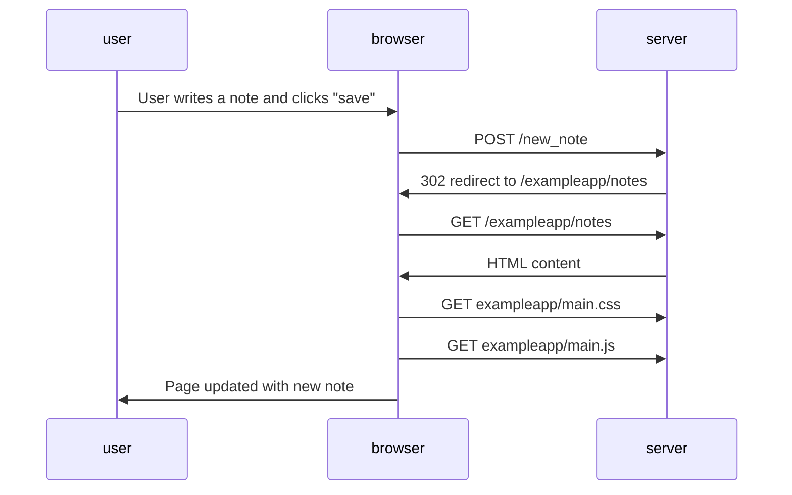

```mermaid
sequenceDiagram
    participant U as user
    participant B as browser
    participant S as server

    U->>B: User writes a note and clicks "save"
    B->>S: POST /new_note
    S->>B: 302 redirect to /exampleapp/notes
    B->>S: GET /exampleapp/notes
    S->>B: HTML content
    B->>S: GET exampleapp/main.css
    B->>S: GET exampleapp/main.js
    B->>U: Page updated with new note
```