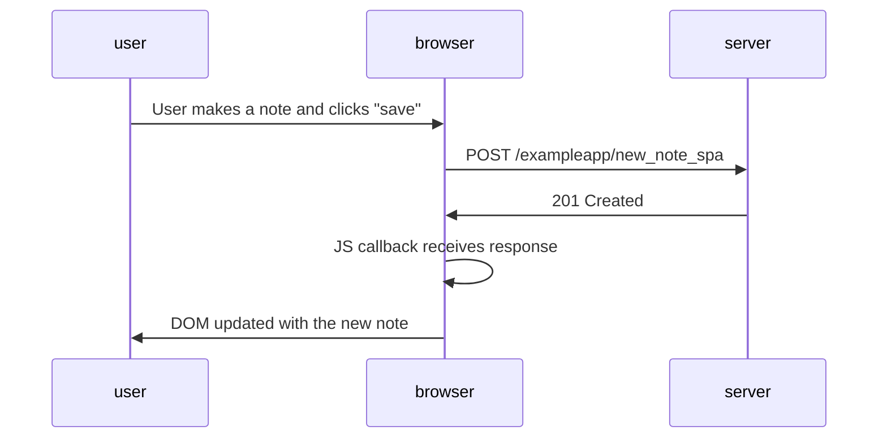

```mermaid
sequenceDiagram
    participant U as user
    participant B as browser
    participant S as server

    U->>B: User makes a note and clicks "save"
    B->>S: POST /exampleapp/new_note_spa
    S->>B: 201 Created
    B->>B: JS callback receives response
    B->>U: DOM updated with the new note
```