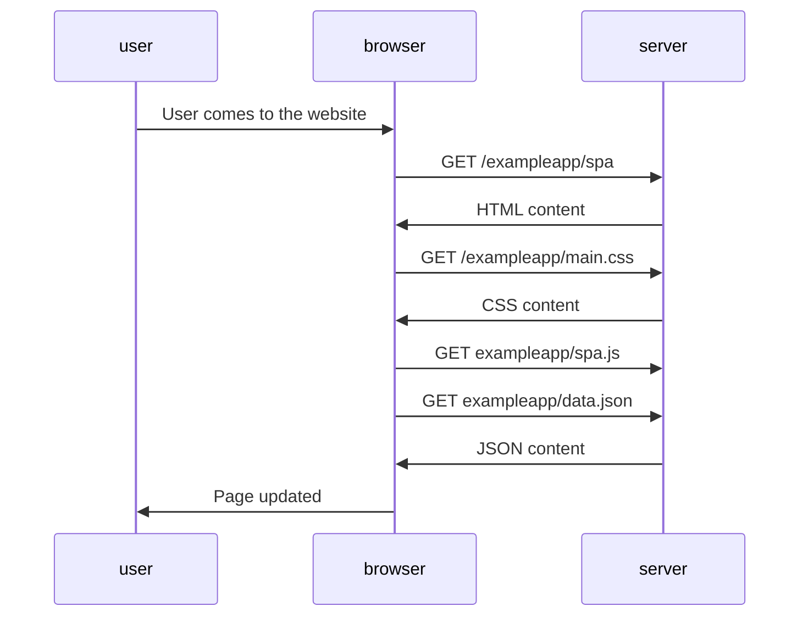

```mermaid
sequenceDiagram
    participant U as user
    participant B as browser
    participant S as server

    U->>B: User comes to the website
    B->>S: GET /exampleapp/spa
    S->>B: HTML content
    B->>S: GET /exampleapp/main.css
    S->>B: CSS content
    B->>S: GET exampleapp/spa.js
    B->>S: GET exampleapp/data.json
    S->>B: JSON content
    B->>U: Page updated
```